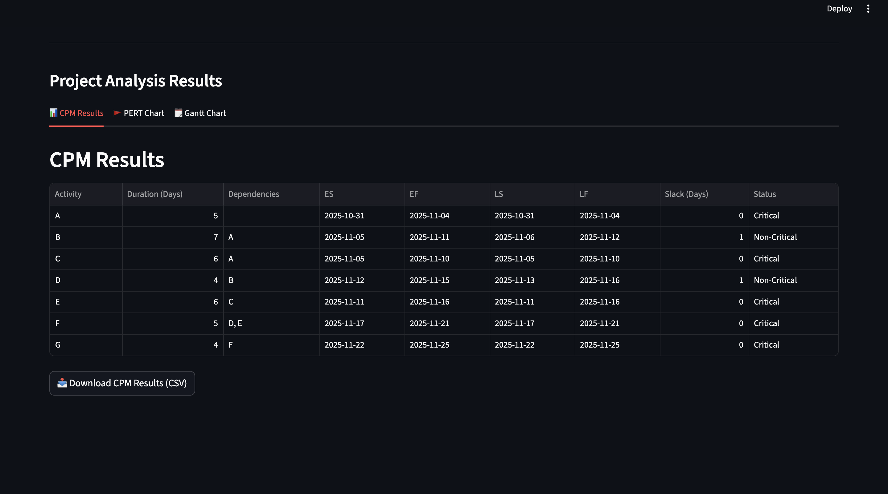
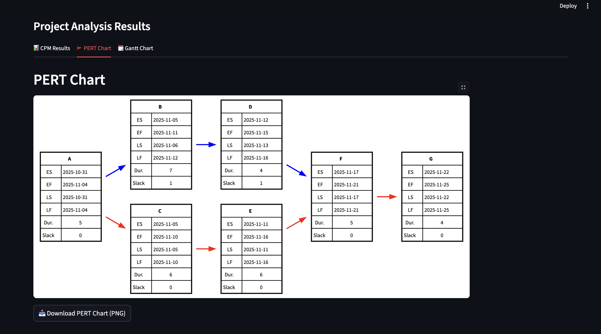
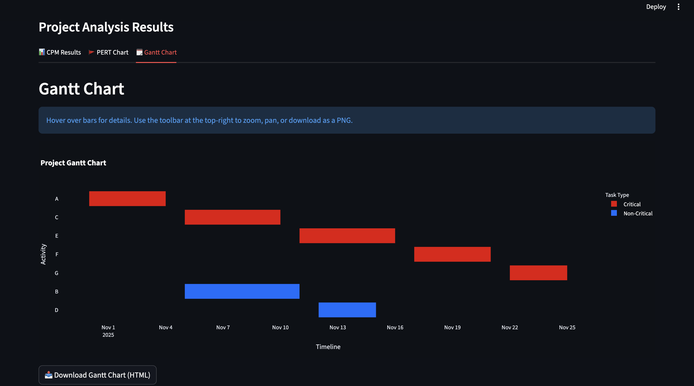

Berikut README.md yang rapi dan profesional untuk proyek **Project Scheduler** kamu — sudah lengkap dari setup environment, cara run, hingga catatan untuk Graphviz dan Streamlit:

---

# Project Scheduler App

**Project Scheduler App** adalah aplikasi berbasis **Streamlit** yang digunakan untuk menghitung dan memvisualisasikan **Critical Path Method (CPM)** dari suatu proyek.
Aplikasi ini dapat menampilkan hasil dalam bentuk **tabel CPM**, **diagram PERT**, dan **Gantt Chart**, lengkap dengan kemampuan **import/export CSV**.

---

## Fitur Utama

| Fitur                | Deskripsi                                                                                                                                    |
| -------------------- | -------------------------------------------------------------------------------------------------------------------------------------------- |
| CPM Calculation   | Menghitung ES (Earliest Start), EF (Earliest Finish), LS (Latest Start), LF (Latest Finish), dan Slack (Days) untuk setiap aktivitas proyek. |
| Gantt Chart       | Menampilkan timeline aktivitas proyek secara interaktif dengan Plotly.                                                                       |
| PERT Chart       | Membuat diagram jaringan aktivitas proyek dengan Graphviz, menyoroti jalur kritis.                                                           |
| Import/Export CSV | Mengimpor data proyek dari file CSV dan mengekspor hasil perhitungan CPM ke CSV.                                                             |
| Editable Table    | Menambahkan, menghapus, atau mengubah data langsung melalui antarmuka Streamlit.                                                             |
| Download Charts   | Menyediakan opsi untuk mengunduh **PERT Chart (PNG)** dan **Gantt Chart (HTML)**.                                                            |

---

## Persyaratan Sistem

* **Python** ≥ 3.9
* **pip** ≥ 21
* **Graphviz** (wajib untuk membuat dan mengunduh PERT Chart)
* **OS yang didukung:** macOS, Windows, Linux

---

## Instalasi

### 1. Clone Repository

```bash
git clone https://github.com/<username>/project-scheduler.git
cd project-scheduler
```

### 2. Buat Virtual Environment

```bash
python -m venv venv
```

### 3. Aktifkan Environment

* **macOS / Linux**

  ```bash
  source venv/bin/activate
  ```
* **Windows (PowerShell)**

  ```bash
  venv\Scripts\activate
  ```

### 4. Install Dependencies

```bash
pip install -r requirements.txt
```

Jika kamu belum membuat file `requirements.txt`, berikut isinya:

```text
streamlit
pandas
plotly
graphviz
```

---

## Instalasi Graphviz

Graphviz diperlukan agar fitur **PERT Chart** dapat dibuat dan diunduh.
Sesuaikan dengan sistem operasi yang digunakan.

### macOS

Gunakan **Homebrew**:

```bash
brew install graphviz
```

### Windows

Unduh dari situs resmi Graphviz:

> [https://graphviz.org/download/](https://graphviz.org/download/)

Setelah instalasi, **tambahkan path Graphviz ke Environment Variables** agar dapat digunakan dari Python.

### Linux (Debian/Ubuntu)

```bash
sudo apt update
sudo apt install graphviz
```

---

## Menjalankan Aplikasi

Setelah semua dependensi terinstal, jalankan aplikasi Streamlit dengan perintah berikut:

```bash
streamlit run app.py
```

Atau jika nama file kamu berbeda, sesuaikan:

```bash
streamlit run project_scheduler.py
```

Kemudian buka browser dan akses:

```
http://localhost:8501
```

---

## Format CSV yang Didukung

Aplikasi ini menerima file CSV dengan **3 kolom wajib** dalam urutan berikut:

| Activity | Duration (Days) | Dependencies |
| -------- | --------------- | ------------ |
| A        | 5               |              |
| B        | 7               | A            |
| C        | 6               | A            |
| D        | 4               | B            |
| E        | 6               | C            |
| F        | 5               | D, E         |
| G        | 4               | F            |

> Kolom **Dependencies** menggunakan pemisah koma (`,`).
> Biarkan kosong jika aktivitas tidak memiliki dependensi.

---

## Output Hasil Analisis

Setelah menjalankan analisis, aplikasi akan menampilkan:

| Kolom        | Keterangan                                                        |
| ------------ | ----------------------------------------------------------------- |
| ES           | Earliest Start (tanggal mulai paling awal)                        |
| EF           | Earliest Finish (tanggal selesai paling awal)                     |
| LS           | Latest Start (tanggal mulai paling akhir tanpa menunda proyek)    |
| LF           | Latest Finish (tanggal selesai paling akhir tanpa menunda proyek) |
| Slack (Days) | Waktu tenggang (perbedaan LF-EF)                                  |
| Status       | Penanda apakah aktivitas berada di jalur kritis                   |

---

## Contoh Hasil

**1. CPM Results Table**



Menampilkan hasil perhitungan CPM secara lengkap dalam tabel, yang dapat diunduh sebagai CSV.

**2. PERT Chart**



Menampilkan diagram jaringan proyek.

* Garis **merah** = jalur kritis
* Garis **biru** = jalur non-kritis

**3. Gantt Chart**



Visualisasi interaktif dengan Plotly yang menunjukkan urutan aktivitas berdasarkan waktu mulai dan selesai.